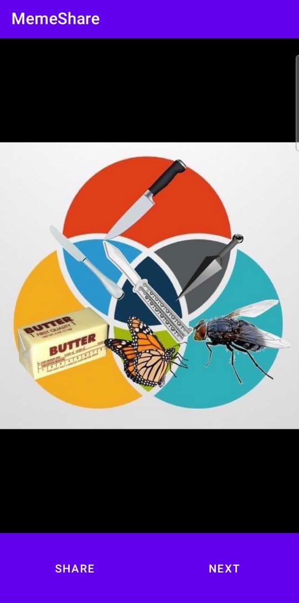

# Memeshare-App
In this App, mems image or short videos  come from  reddit server, everytime when you hit  next button , it changes  and if you want to share with your friends , it also provides the facililty to share , for this you  can press share button

# Technologies used:-
XML,
Kotlin,
Android 

Screenshots
-----------

